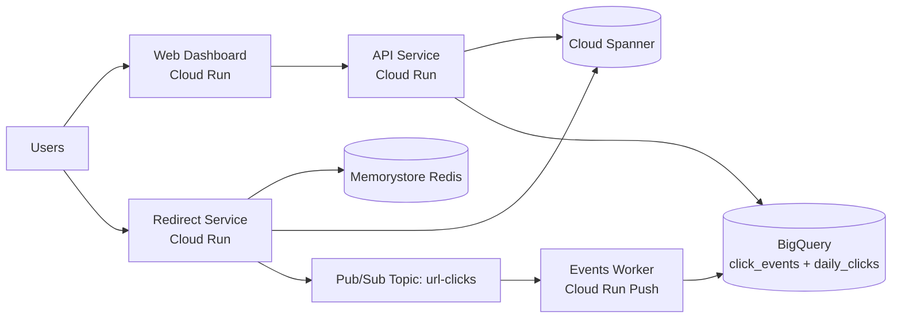

# URL Shortner System Design (Scalable GCP Architecture)

## 1) What this system is

This repository implements a **scalable URL shortener** on Google Cloud with:

- `web-dashboard` (Cloud Run): user dashboard with Firebase Google Sign-In
- `api-service` (Cloud Run): authenticated CRUD for short links + analytics reads
- `redirect-service` (Cloud Run): public `GET /:code` redirect path
- `events-worker` (Cloud Run): Pub/Sub push consumer for click analytics aggregation
- Cloud Spanner: source of truth for URL mappings
- Memorystore (Redis): hot-path cache for `code -> destination`
- Pub/Sub: click event transport
- BigQuery: detailed click events + daily aggregates

Primary deployment region: `asia-south1`.

## 2) High-level architecture

## 3) Request flows

### 3.1 Create/update/list links (authenticated)

1. User signs in with Google via Firebase Auth.
2. Dashboard calls `api-service` with Firebase JWT.
3. API verifies JWT, writes/reads URL metadata in Spanner.
4. API returns short code and management data.

### 3.2 Public redirect

1. Client calls `GET /:code` on `redirect-service`.
2. Service checks Redis cache.
3. On miss, service reads Spanner and backfills Redis (TTL 300s).
4. Returns `302` redirect to destination URL.
5. Publishes click event to Pub/Sub asynchronously.

### 3.3 Analytics pipeline

1. `redirect-service` publishes click events to Pub/Sub.
2. `events-worker` (push subscription) writes detailed events to `click_events`.
3. Worker upserts daily aggregates into `daily_clicks`.
4. `api-service` reads aggregated analytics for dashboards.

## 4) Live deployed baseline (as of 2026-03-20)

- Spanner: `STANDARD` edition, regional `asia-south1`, **100 processing units**
- Redis: `STANDARD_HA`, **1 GiB**
- Cloud Run services (all): concurrency 80, min instances 0
  - `redirect-service` max instances: 100
  - `api-service` max instances: 20
  - `events-worker` max instances: 20
  - `web-dashboard` max instances: 10
- Serverless VPC Access connector: `e2-micro`, min 2, max 3

## 5) Capacity math (why this can support large scale)

### 5.1 Spanner performance reference

From Spanner performance guidance for **regional SSD**:

- 1,000 PU (1 node) ≈ **22,500 reads/s**
- 1,000 PU (1 node) ≈ **3,500 writes/s**

With 100 PU (0.1 node):

- peak reads ≈ 2,250/s
- peak writes ≈ 350/s

Using 65% target utilization for operational headroom:

- effective reads ≈ 1,462/s
- effective writes ≈ 228/s

### 5.2 100M DAU scenario assumptions

Assumptions for sizing (explicit):

- DAU = 100,000,000
- Redirects per user/day = 6
- Total redirects/day = 600,000,000
- Peak-to-average factor = 4
- Redis hit ratio = 95%
- New short links/day = 3,000,000 (0.03 per user/day)

Derived traffic:

- Average redirect RPS = 600,000,000 / 86,400 = 6,944
- Peak redirect RPS = 6,944 × 4 = **27,778**
- Spanner read RPS at peak (cache misses only) = 27,778 × 5% = **1,389/s**
- Spanner write RPS at peak (link creates only) = (3,000,000 / 86,400) × 4 = **139/s**

Capacity check against 100 PU effective limits:

- reads: 1,389/s < 1,462/s  ✅
- writes: 139/s < 228/s ✅

Cloud Run redirect autoscaling check:

- Required instances at peak ≈ (RPS × latency) / concurrency
- Assume avg latency = 40 ms: (27,778 × 0.04) / 80 = **14 instances**
- Max configured = 100 instances ✅

Conclusion:

- With the above assumptions and 95% cache-hit behavior, current baseline can handle 100M DAU redirect volume.
- If redirects/user/day grows materially (for example 15–20/day), increase Spanner PU and Redis size; both scale linearly.

## 6) Pricing inputs used (snapshot)

Pricing snapshot date: **2026-03-20** (USD), `asia-south1`, from Cloud Billing Catalog API SKUs:

- Spanner compute (standard read-write replica): **$0.42 / node-hour** (`B498-C3A3-151E`)
  - 100 PU = 0.1 node => **$0.042/hour**
- Spanner storage: **$0.42 / GiB-month** (`B3BA-EC2A-D97C`)
- Redis Standard M1 capacity: **$0.11 / GiB-hour** (`E546-A818-9A77`)
- Cloud Run requests: **$0.40 / million requests** after first 2M (`2DA5-55D3-E679`)
- Cloud Run CPU: **$0.000024 / vCPU-second** (`4856-B847-F1EB`)
- Cloud Run memory: **$0.0000025 / GiB-second** (`02A2-9231-36A6`)
- Cloud Run internet egress Asia->Asia: **$0.12 / GiB** (`9EA6-AE6D-E34E`)
- Pub/Sub message delivery: **$40 / TiB** after 10 GiB free (`027D-B6C7-CCA2`)
- BigQuery streaming insert (asia-south1): **$0.00006 / MiB** (`AC85-E714-3881`)
- BigQuery active logical storage (asia-south1): **$0.023 / GiB-month** after first 10 GiB (`E056-7501-89FA`)
- BigQuery analysis (asia-south1): **$7.50 / TiB** after first 1 TiB (`B898-EB89-E9CA`)

## 7) Cost estimate model

These are **engineering estimates**, not billing guarantees. Taxes, discounts, committed-use discounts, and free-tier interactions can change final invoices.

### 7.1 Scenario A: 100M DAU

Assumptions (for cost only):

- 600M redirects/day
- Avg redirect latency 40 ms, concurrency 80
- Redirect response size 0.8 KiB
- Click event payload 200 bytes
- BigQuery query scan for analytics: 2 TiB/day
- Baseline infra kept as currently deployed (100 PU Spanner, Redis 1 GiB, connector running)

Estimated daily costs:

- Spanner compute (100 PU): $1.01/day
- Redis 1 GiB Standard: $2.64/day
- Serverless VPC connector baseline: ~$0.40/day
- Cloud Run request charges: $240.00/day
- Cloud Run CPU + memory runtime: ~$7.58/day
- Cloud Run egress (redirect responses): ~$54.93/day
- Pub/Sub delivery: ~$4.37/day
- BigQuery streaming inserts: ~$6.87/day
- BigQuery storage (90-day retention steady state): ~$7.70/day
- BigQuery analysis queries: ~$15.00/day

**Total: ~$340.49/day (~$10,214.71/month)**

Cost concentration:

- Most cost comes from Cloud Run request billing + internet egress, not Spanner compute at this baseline.

### 7.2 Scenario B: 10 DAU

Assumptions:

- 10 users/day, 6 redirects/user/day (60 redirects/day)
- Same provisioned baseline (Spanner 100 PU + Redis 1 GiB + connector)

Estimated daily costs:

- Spanner compute (fixed): $1.01/day
- Redis (fixed): $2.64/day
- Serverless VPC connector baseline: ~$0.40/day
- Variable request/data costs: effectively near $0/day at this traffic

**Total: ~$4.05/day (~$121.44/month, ~$28.34/week)**

Key insight:

- Low-traffic spend is dominated by fixed always-on data layer choices (Redis + Spanner + connector), not request volume.

## 8) Practical scaling and cost controls

- For very high request volume, optimize **request count and egress path** first (largest cost drivers here).
- Keep redirect payload tiny and push static assets behind CDN.
- Raise Redis hit ratio to reduce Spanner read load and latency variance.
- If low traffic is expected, reduce fixed-cost baseline:
  - scale down/replace Redis tier
  - review Spanner minimum PU strategy
  - revisit VPC connector necessity for your network pattern

## 9) Notes for public repository readers

This repository is a reference implementation for a scalable URL shortener architecture.

- Deployment resources in GCP are managed per project and can be deleted at any time.
- Public URLs used during testing are not guaranteed to remain active.
- Use the code and infrastructure definitions as the primary artifact, not any temporary deployed endpoint.

## 10) References

- Spanner performance overview: https://cloud.google.com/spanner/docs/performance
- Cloud Billing Catalog API: https://cloud.google.com/billing/docs/reference/rest/v1/services.skus/list
